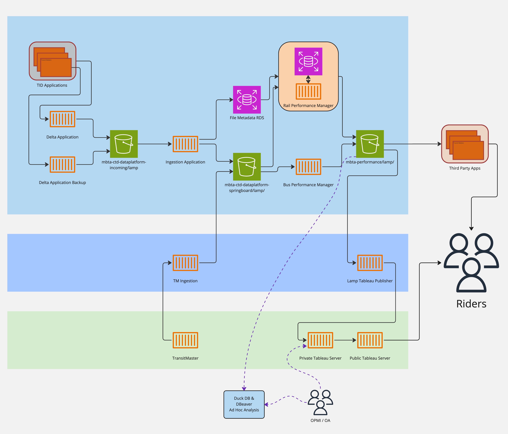

# Lightweight Application for Measuring Performance (LAMP)
LAMP is a collection of applications used to measure performance of the MBTA transit system.

## LAMP Applications:
* [Ingestion (Parquet Archiver)](python_src/src/lamp_py/ingestion/README.md)
* [Performance Manager (Rail Performance)](python_src/src/lamp_py/performance_manager/README.md)

## Architecture

LAMP application architecture is managed and described using `Terraform` in the [MBTA Devops](https://github.com/mbta/devops) github repository. 



[Link](https://miro.com/app/board/uXjVOzXKW9s=/?share_link_id=356679616715) to Miro Diagram


# Developer Usage

## Dependencies

LAMP uses [asdf](https://asdf-vm.com/) to mange runtime versions using the command line. Once installed, run the following in the root project directory:

```sh
# add project plugins
asdf plugin-add python
asdf plugin-add direnv
asdf plugin-add poetry
asdf plugin-add erlang
asdf plugin-add elixir

# install versions of plugins specified in .tool-versions
asdf install
```

`poetry` is used by LAMP python applications to manage dependencies. 

`docker` and  `docker-compose` are required to run containerized versions of LAMP applications for local development.

## AWS Credentials

LAMP applications require permissions to access MBTA/CTD AWS resources. 

To get started with AWS, install the [AWS Command Line Interface](https://aws.amazon.com/cli/). Then, follow the instructions for [configuring the AWS cli](https://docs.aws.amazon.com/cli/latest/userguide/cli-configure-quickstart.html#cli-configure-quickstart-creds) to associate a local machine with an AWS account.  Finally, associate the AWS Account with the [Lamp Team User Group](https://github.com/mbta/devops/blob/627ab870f51b4bb9967f0f45efaee679e4a7d195/terraform/restricted/iam-user-groups.tf#L204-L213) found in the MBTA devops terraform repository.

## Environmental Variables

Project environmental variables are stored in [.env](.env) and managed for command line usage with `direnv`.

Using `direnv`, whenever a shell moves into any project directory, the environmental variables defined in [.env](.env) are loaded automagically. 

Additionally, [docker-compose.yml](docker-compose.yml) is configured to use [.env](.env), so that running containerized applications will load the same environmental variables.

## Continuous Integration

To ensure code quality, linting, type checking, static analysis and unit tests are automatically run via github actions when pull requests are opened. 

CI for LAMP python applications can be run locally, in the `python_src/` directory, with the following `poetry` commands:
```sh
# black for Formatting
poetry run black .

# mypy for Type Checking
poetry run mypy .

# pylint for Static Analysis
poetry run pylint src tests

# pytest for Unit Tests
poetry run pytest
```

## Continuous Deployment

Images for LAMP applications are hosted by AWS on the Elastic Container Registry (ECR). Updates to application images are pushed to ECR via automated github actions. 

LAMP applications are hosted by AWS and run on Elastic Container Service (ECS) instances. Deployment of LAMP applications, to ECS instances, occur via automated github actions.

## Running Locally

LAMP uses `docker` and `docker-compose` to run local instances of applications for development purposes. Please refer to the `README` page of invidiual applications for instructions. 


## Repository Design 

This repository contains all LAMP source code used to run, test and deploy LAMP applications.

Source code for LAMP python applications can be found in the [python_src/](python_src/)  directory. 

Source code for the elixir API application can be found in the [api/](api/) directory.

### `python_src/` [Python Application Library]

The [python_src/](python_src/) directory contains a shared python library used by all LAMP python applications.

The shared library is structured in a standard source and tests directory structure.

The root of the [python_src/](python_src/) directory contains files that define dependencies and tooling ([python_src/pyproject.toml](python_src/pyproject.toml)), database management configuration ([python_src/alembic.ini](python_src/alembic.ini)), and application containers ([python_src/Dockerfile](python_src/Dockerfile)).
