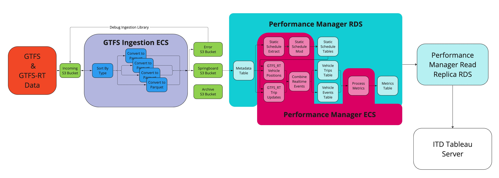

# LAMP
Lightweight Application for Measuring Performance

## Architecture

[Link](https://miro.com/app/board/uXjVOzXKW9s=/?share_link_id=356679616715) to
Miro Diagram

### GTFS to Parquet
Raw Real Time GTFS files are collected in an incoming S3 bucket and are
populated by [Delta](https://github.com/mbta/delt), a small service that logs
http files to the bucket configurably. A python based lambda collects all of the
files in the incoming bucket and organizes them into batches of similar types.
These batches are then processed by a second python based lambda that adds all
of the data in each real time gtfs file into a single parquet file. These
parquet files are then uploaded to a separate S3 bucket, with all processed
files moved to an archive.

The python module used for batching and conversions is located in
`/py_gtfs_rt_ingestion/`, along with its tests and the scripts that are
triggered in each of the lambda functions. This modules, its dependencies, and
the scripts are zipped up together before being deployed to the lambda
functions.

#### Types of GTFS Files
* Real Time Alerts
* Real Time Bus Trip Updates
* Real Time Bus Vehicle Positions
* Real Time Trip Updates
* Real Time Vehicle Count
* Real Time Vehicle Positions
* Schedule Data

Information on the parquet table format for these file types can be found
[here](parquet_schemas.md).

### Parquet to Relational Database
AWS Glue, or a similar service, will be used to concatenate and join the parquet
files. This will create intermediate data representations that will be loaded
into an RDS for low latency access.

### Relational Database Analyzed in ECS
The relational database of all the historical data will be analyzed via Elixir.


## Developer Usage

### Setup
This repo uses [asdf](https://asdf-vm.com/) to mange runtime versions using the
command line. Once its installed, run the following:
```sh
# Add Plugins for Poetry and Python (needed by py_gtfs_rt_ingestion)
asdf plugin-add poetry
asdf plugin-add python

# Install the correct versions of each plugin from .tool-versions
asdf install
```

Many of the pieces of this repo will require you to have permissions to access
our S3 Buckets and trigger our dev instance lambda functions. First, install the
[AWS Command Line Interface](https://aws.amazon.com/cli/). Then, from your AWS
account,
[create an AWS key](https://docs.aws.amazon.com/cli/latest/userguide/cli-configure-quickstart.html#cli-configure-quickstart-creds)
to associate with your machine and configure your machine using `aws
configure`. Finally, make sure your AWS Account is associated with the [Lamp
Team](https://github.com/mbta/devops/blob/627ab870f51b4bb9967f0f45efaee679e4a7d195/terraform/restricted/iam-user-groups.tf#L204-L213)
User Group inside of the MBTA devops terraform repository.

### py_gtfs_rt_ingestion 
Dependency management in this module is handled by [poetry](python-poetry.org),
which is installed via asdf. It will create a virtual env with all of the
projects dependencies in it with `poetry install`.

There are two scripts at the top level of this directory used by the lambda
functions and a third helper script.

* `batch_files.py` - create batches of files to process out of an incoming bucket.
  These batches can either be output as a list of lambda event dicts or the
  ingestion lambda can be triggered directly.
* `ingest.py` - create a parquet table out of the entries of a list of gtfs
  files that are stored locally or on s3. s3 files are moved to an archive
  bucket on successful conversion and an error bucket on failure. parquet tables
  are saved to an outgoing bucket.
* `dev_test_setup.py` - setup the s3 dev import, archive, error, and output
  buckets to run end to end testing.

To run these scripts, use `poetry shell` to spawn a shell within the virtual
environment. They can then be run on the command line. See `--help` for more
information.

Run linting, type checking, static analysis, and tests (which all run on pull
request) with:
```sh
# Run black for Formatting
poetry run black .

# Run mypy for Type Checking
poetry run mypy .

# Run pylint for Static Analysis
poetry run pylint py_gtfs_ingestion tests *.py

# Ru pytest to run unit tests
poetry run pytest
``
