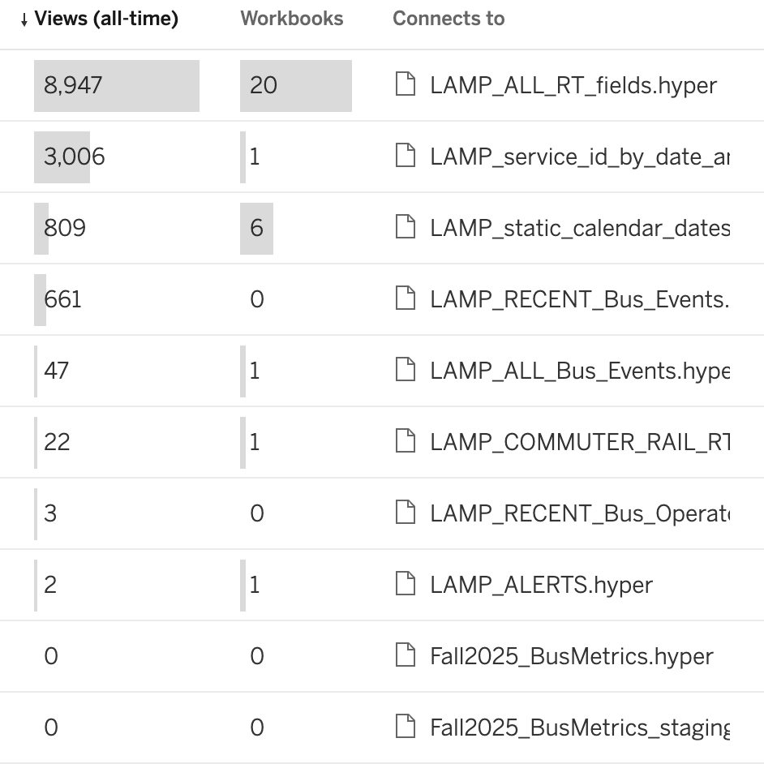

# We articulated 3 outcomes we want

1. We measure how are data are used
2. Users access existing data without asking us
3. Users create and own analytical views of our data

## But today

1. We can only measure views of Tableau data sources
2. Users ask us for data, for access, and to understand what data we produce
3. We create and maintain analytical views of our data

## Our current implementations keep us from these outcomes

* To find data, users need to browse several different s3 buckets and understand our ingestion architecture
* We have no tooling to measure usage of queries directly to s3
* AWS IAM prevents us from granting users access to individual columns
* Tableau has limited tools to query files in s3

## New implementations could help us achieve these outcomes

. . .

* A data catalog could allow
    - users to quickly list available datasets and describe their contents
    - us to control access at the column level
    - us to measure usage from DuckDB, Polars, and more

. . .

* A "serverless" query engine could allow
    - us to measure queries *from* Tableau
    - users to build new analytical views from Tableau

. . .

* A dedicated pipeline orchestrator could allow
    - us & users to schedule and monitor analytical views
    - us to measure queries *to* Tableau
    - us & users to isolate failing jobs from successful jobs


# One example
You want to calculate average speed by bus route


# 1. You query it locally in DuckDB or Polars

## 1. You want speed, but have no need for operator name

We decide between 4 unscalable options:

1. Grant you access beyond the principle of least privilege
2. Deploy a new table with all the data *except* operator name
3. Deny your access request
4. Create exports of the data

## 1. We grant you access, you query

```{.sql filename="DuckDB"}
ATTACH 's3://mbta-ctd-dataplatform-archive/lamp/catalog.db' AS lamp;

SELECT *
FROM lamp.read_ymd('BUS_VEHICLE_POSITIONS', make_date(2024, 3, 2), make_date(2024, 4, 1))
```

Different query engines provide different identifiers that users need to remember.

```{.python filename="Polars"}
(
    pl.scan_parquet("""
        s3://mbta-ctd-dataplatform-springboard/
        lamp/BUS_VEHICLE_POSITIONS/
        year=2024/
    """)
    .filter(pl.col("month").eq(3), pl.col("day").between(2, 30))
)
```

Both of these yield

| vehicle_id | route_id | ... | operator_name |
|------------|----------|-----|---------------|
| y1234      | 1        | ... | Charlie       |
| y56789     | 1        | ... | Charlene      |

## 1. With a data catalog


```{.sql filename="DuckDB"}
ATTACH 'https://lamp.mbta.com' AS lamp (TYPE unity_catalog);

SELECT *
FROM lamp.prod.unrestricted.bus_vehicle_positions
WHERE message_date BETWEEN make_date(2024, 3, 2)
    AND make_date(2024, 3, 31)
```

Users find consistency...

```{.python filename="Polars"}
(
    pl.Catalog('https://lamp.mbta.com')
    .scan_table('prod.unrestricted.bus_vehicle_positions')
    .filter(
        pl.col("message_date").between(
            pl.Date(2024, 3, 2),
            pl.Date(2024, 3, 31)
        )
    )
)
```

..and we can control access at the column level without creating new storage:

| vehicle_id | route_id | ... |
|------------|----------|-----|
| y1234      | 1        | ... |
| y56789     | 1        | ... |


# 2. You find it in Tableau

## 2. But it doesn't exist yet!

We decide between 2 unscalable options:

1. Create a new single-user data source that we maintain
2. Deny your request

## 2. We spend 2-6 weeks creating a new data source


```{mermaid}
%%| echo: false
sequenceDiagram
    us->>+users: How does this look?
    users-->>-us: Where can I find it?
    us->>+users: Here's an export!
    users-->>-us: Let's add a column
    us->>+users: How about now?
    users-->>-us: Good!
    us->>+users: Okay, it's in production
    users-->>-us: I found a new use! Let's change the granularity
    us->>+users: Okay, that'll be a new table
    users-->>-us: Gotcha, how long will that take?
```

## 2. With a tool to create analytical views

```{mermaid}
%%| echo: false
sequenceDiagram
    users->>+users: How does this look?
    users-->>-users: Good!
    users->>+users: Let me make a new PR
    users->>+us: Can I have some more access for this column?
    us-->>-users: Sure.
    users->>+users: Okay, Now I can make a new table.
```

# 3. Analyze! Share! Decide!

## 3. Who knows if you actually use(d) it?

## 3. Today, we can learn about Tableau usage

::: {.fig-align-center}

:::

## 3. With a data catalog and/or AWS CloudTrail, we can learn about S3 usage as well

# What tools should we choose?

Data catalogs and orchestrators are not coupled: each would be beneficial on its own.
On the other hand, query engines are more tightly coupled to data catalogs:

* Unity Catalog → Trino
* AWS Glue → AWS Athena
* DuckLake provides native integration with a serverless query engine


See [this Notion](https://www.notion.so/mbta-downtown-crossing/Analytical-Data-Infrastructure-312f5d8d11ea8073a894c22662327d30?source=copy_link#313f5d8d11ea80d6a524fa426dd0bc08) for a feature comparison.

## I recommend Dagster

for its data-aware orchestration and monitoring UI.

We should evaluate the decision of a data catalog and query engine together.

. . .

On the one hand, Unity Catalog integrates natively with DuckDB and Polars, on the other hand, AWS Glue provides a more mature catalog and allows us to manage access using Terraform.
