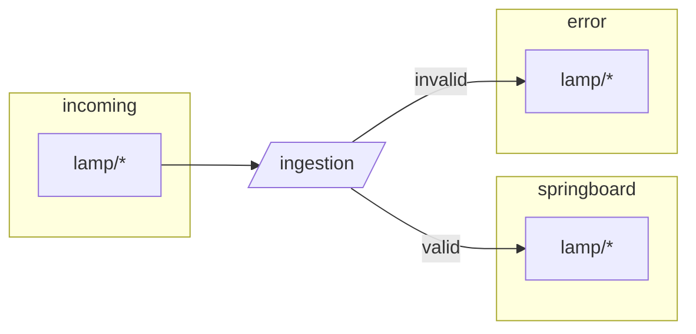
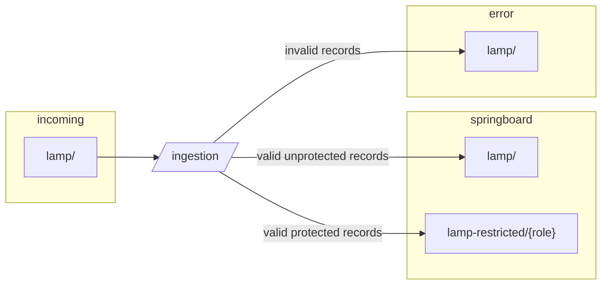

# Ingestion

Ingestion is an application to transform and aggregate GTFS-RT and GTFS Static files into parquet files for storage in AWS S3 buckets.

## Application Operation

Ingestion operates with a chronologic event loop with a 5 minute delay between each iteration.

Ingestion connects to the [Performance Manager](../performance_manager/README.md) application via the `metadata_log` table of the Metadata RDS. When Ingestion creates a new parquet file, the S3 path of that file is written to the `metadata_log` table for Performance Manager to process.

For each event loop, GTFS Static files are processed prior to any GTFS-RT files, when available.

## Event Loop Summary

1. List all files from `incoming` S3 bucket
2. Bucket files into applicable `Converter` class
3. Start `converter` loop of each `Converter` class, creating parquet files
4. Write parquet file to S3 Bucket
5. Write S3 path of parquet file to `metadata_log` table for Performance Manager
6. Move successfully processed `incoming` files to `archive` bucket
7. Move un-successfully processed `incoming` files to `error` bucket

# GTFS Static

[GTFS Static](https://www.mbta.com/developers/gtfs) Zip files are generated by MBTA for internal and external distribution. 

This application converts GTFS Zip files to partitioned parquet files that are exported to an S3 bucket. This is done with the [GTFS Converter Class](./convert_gtfs.py).

GTFS Static parquet files are written to S3 with the following partitioning:

* [GTFS File Type](https://github.com/mbta/gtfs-documentation/blob/master/reference/gtfs.md#gtfs-files)
* timestamp = datetime extracted from `feed_version` column of [feed_info.txt](https://github.com/mbta/gtfs-documentation/blob/master/reference/gtfs.md#feed_infotxt), converted to UNIX timestamp

# GTFS-RT Data

[GTFS-realtime](https://www.mbta.com/developers/gtfs-realtime) (GTFS-RT) is provided by MBTA as an industry standard for distributing realtime transit data. 

The CTD [Delta](https://github.com/mbta/delta) application is responsible for reading GTFS-RT updates from the MBTA [V3 API](https://www.mbta.com/developers/v3-api) and saving them to an AWS S3 Bucket, as gzipped JSON files, for use by LAMP.

This application aggregates gzipped GTFS-RT update files, saved on S3 by Delta, into partitioned parquet files that are exported to an S3 bucket. The parquet files are partitioned daily, by GTFS-RT feed type. This is done with the [GTFS-RT Converter Class](./convert_gtfs_rt.py)

GTFS-RT parquet files are transformed and partitioned based on their `Converter Class` configuration:

* [Busloc Trip Updates](./config_busloc_trip.py)
* [Busloc Vehicle Positions](./config_busloc_vehicle.py)
* [Realtime Vehicle Positions](./config_rt_vehicle.py)
* [Realtime Trip Updates](./config_rt_trip.py)
* [Sevice Alerts](./config_rt_alerts.py)

# Compressed GTFS Archive Files

GTFS Zip files are converted to yearly partitioned parquet files, using a differential compression process, and exported to AWS S3 for publishing/storage.

For more Information about these files, please see: https://performancedata.mbta.com/

# Protecting personal data

For files we ingest without personal data, the data flows intact from the `incoming` bucket to `springboard` unless their contents contain invalid schema, encoding, contents, etc:



Files that include protected data add an additionanl step to separately store that data.
Protected data columns are sent, by role to a subdirectory of the `lamp-restricted` prefix according to the access role required to view them.



Each file in the `lamp-restricted` prefix can be joined back to the same-named file in the `lamp` prefix by the primary keys of the files.
For example, consider operator fields contained in messages from BusLoc:

```json
{
    "id": "1735689597_3277",
    "vehicle": {
        "operator": {
            "id": 12345,
            "name": "Lee",
            "first_name": "Sam",
            "last_name": "Lee",
            "logon_time": 1735683380
        }
    }
}
```

In our approach, `name`, `first_name`, `last_name`, and (potentially) `vehicle.operator.id` should be protected.
This message would be stored in `springboard/lamp/BUS_VEHICLE_POSITIONS/` as

```json
{
    "id": "1735689597_3277",
    "vehicle": {
        "operator": {
            "logon_time": 1735683380
        }
    }
}
```

The protected values are split between a location accessible to those who can access operator ID and those who can access operator name.
(In this example, it's likely those who can access name can also access Id but consider the possibility of distinct protected fields such as `name` and `credit_card_number`.)
So, in `springboard/lamp-restricted/` there woudld be 2 new streams of files created:

1. `springboard/lamp-restricted/operator-id/BUS_VEHICLE_POSITIONS/`, with records like

    ```json
    {
        "id": "1735689597_3277",
        "vehicle": {
            "operator": {
                "id": 12345
            }
        }
    }
    ```
    Which can be read by users with `GetObject` privileges on `springboard/lamp-restricted/operator-id/`

2. `springboard/lamp-restricted/operator-name/BUS_VEHICLE_POSITIONS`, with records like

    ```json
    {
        "id": "1735689597_3277",
        "vehicle": {
            "operator": {
                "name": "Lee",
                "first_name": "Sam",
                "last_name": "Lee",
            }
        }
    }
    ```
    Which can be read by users with `GetObject` privileges on `springboard/lamp-restricted/operator-name/`

Users would then join on `id` to reassemble the full records.

This approach allows us to control access by information type without provisioning access per file. It also provides users a predictable way to locate and re-assemble protected information.
However, it does limit users' ability to aggregate by protected fields.
An alternative approach could anonymize operator Id but keep it consistent over service dates.
